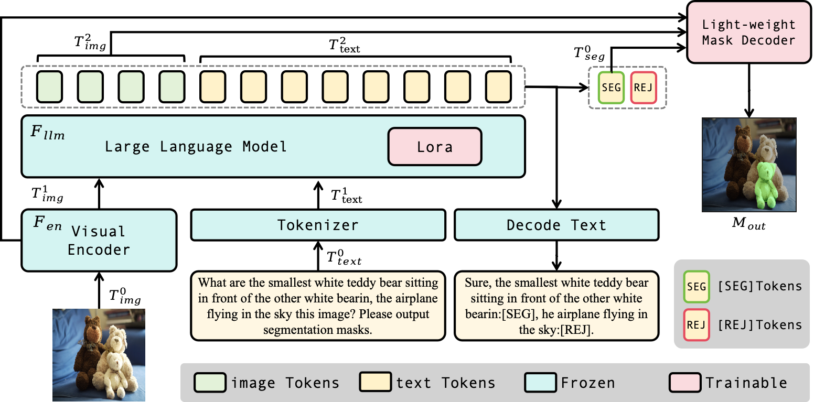
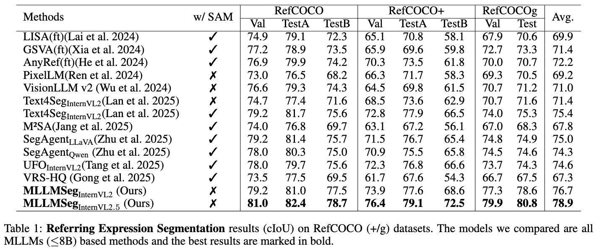
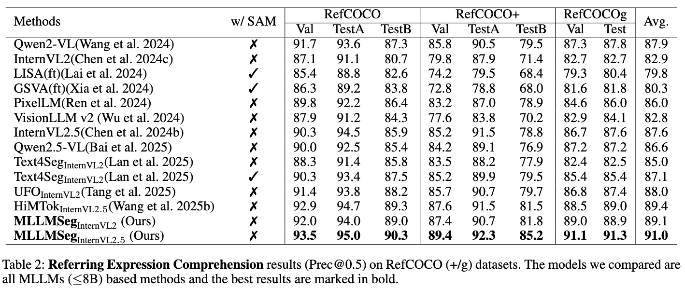
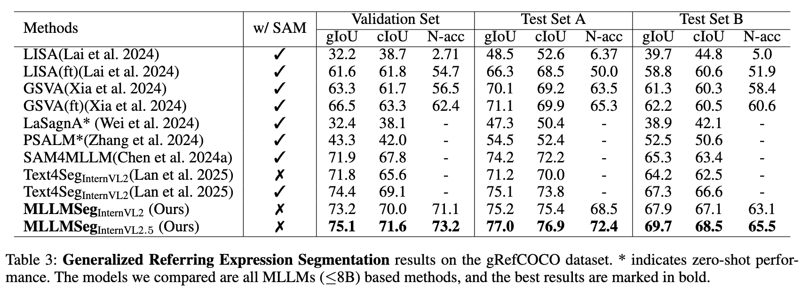
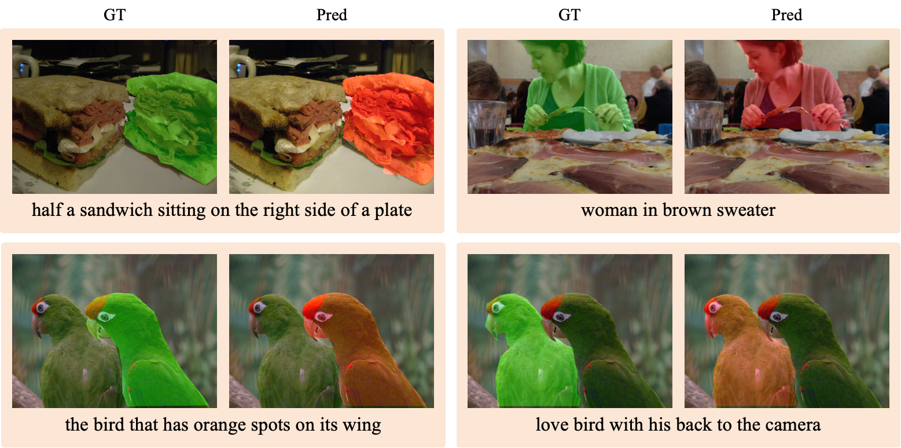
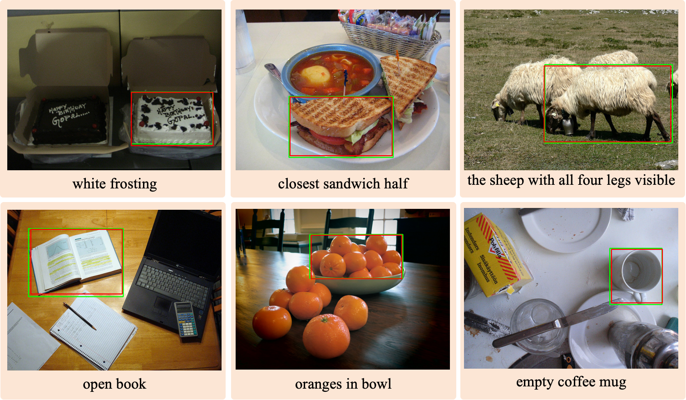
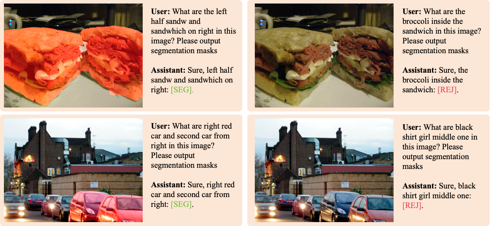

# MLLMSeg: Unlocking the Potential of MLLMs in Referring Expression Segmentation via a Light-weight Mask Decoder

[](https://huggingface.co/papers/2508.04107)
[](http://arxiv.org/abs/2508.04107)
[](https://www.python.org/downloads/)
[](https://pytorch.org/)
[](https://huggingface.co/docs/transformers/)



## 📋 Overview

- [🚀 Quick Start](#-quick-start)
- [📊 Performance Metrics](#-performance-metrics)
- [👀 Visualization](#-visualization)
- [📦 Checkpoints](#-checkpoints)
- [🤝 Contributing](#-contributing)
- [📄 License](#-license)
- [🙏 Acknowledgments](#-acknowledgments)

## 👀 Todo

- [ ] Release demo of MLLMSeg
- [x] Release model checkpoints

## 🚀 Quick Start

### Installation

```bash
conda create -n mllmseg python==3.10.18 -y
conda activate mllmseg
pip install torch==2.5.1 torchvision==0.20.1 --index-url https://download.pytorch.org/whl/cu118
# If you encounter any problems during the installation of datasets, please install this first.
# conda install -c conda-forge pyarrow
pip install -r requirements.txt
pip install flash-attn==2.3.6 --no-build-isolation # Note: need gpu to install
```

### Data Preparation
Referring segmentation datasets: [refCOCO](https://web.archive.org/web/20220413011718/https://bvisionweb1.cs.unc.edu/licheng/referit/data/refcoco.zip), [refCOCO+](https://web.archive.org/web/20220413011656/https://bvisionweb1.cs.unc.edu/licheng/referit/data/refcoco+.zip), [refCOCOg](https://web.archive.org/web/20220413012904/https://bvisionweb1.cs.unc.edu/licheng/referit/data/refcocog.zip), [refCLEF](https://web.archive.org/web/20220413011817/https://bvisionweb1.cs.unc.edu/licheng/referit/data/refclef.zip) ([saiapr_tc-12](https://web.archive.org/web/20220515000000/http://bvisionweb1.cs.unc.edu/licheng/referit/data/images/saiapr_tc-12.zip)) 

Generalized referring segmentation datasets: [gRefCOCO](https://github.com/henghuiding/gRefCOCO), we add the expressions and annotations json files into the `refer_seg` sub-directory, as shown in the tree structure below.


```angular2html
|-- datasets
│   ├── refer_seg
│   │   ├──grefcoco
│   │   ├── images
│   │   |   ├── saiapr_tc-12 
│   │   |   └── mscoco
│   │   |       └── images
│   │   |           └── train2014
│   │   ├── refclef
│   │   ├── refcoco
│   │   ├── refcoco+
│   │   └── refcocog
```

### Model Training

```bash
# Train RES
bash scripts/train_mllmseg.sh

# Train GRES
bash scripts/train_mllmseg_gres.sh
```

### Model Testing

```bash
# Test RES
bash scripts/test_mllmseg.sh

# Test GRES
bash scripts/test_mllmseg_gres.sh
```

### Merge Lora

```bash
# When training GRES, you need to first merge the LORA parameters of the RES model.
python tools/merge_lora_mllmseg.py <input_path> <output_path>
```

## 📦 Checkpoints

Our checkpoints are available at [Baidu Netdisk](https://pan.baidu.com/s/1KzEsHkge47jwSRwAOQ98Xw?pwd=8ycs).

You can also download it from HuggingFace:
[MLLMSeg_InternVL2_5_8B_RES](https://huggingface.co/jcwang0602/MLLMSeg_InternVL2_5_8B_RES)
[MLLMSeg_InternVL2_5_8B_GRES](https://huggingface.co/jcwang0602/MLLMSeg_InternVL2_5_8B_GRES)

## 📊 Performance Metrics

### Referring Expression Segmentation


### Referring Expression Comprehension


### Generalized Referring Expression Segmentation



## 👀 Visualization
### Referring Expression Segmentation


### Referring Expression Comprehension


### Generalized Referring Expression Segmentation


## 🙏 Acknowledgments
This code is developed on the top of [InternVL](https://github.com/OpenGVLab/InternVL), [GSVA](https://github.com/LeapLabTHU/GSVA), and [EEVG](https://github.com/chenwei746/EEVG).

## ✉️ Contact

Email: jcwang@stu.ecnu.edu.cn. Any kind discussions are welcomed!

---

## 📖 Citation
If our work is useful for your research, please consider cite:
```
@misc{wang2025unlockingpotentialmllmsreferring,
      title={Unlocking the Potential of MLLMs in Referring Expression Segmentation via a Light-weight Mask Decoder}, 
      author={Jingchao Wang and Zhijian Wu and Dingjiang Huang and Yefeng Zheng and Hong Wang},
      year={2025},
      eprint={2508.04107},
      archivePrefix={arXiv},
      primaryClass={cs.CV},
      url={https://arxiv.org/abs/2508.04107}, 
}
```
## ✨ Star History
[](https://star-history.com/#jcwang0602/MLLMSeg&Date)
